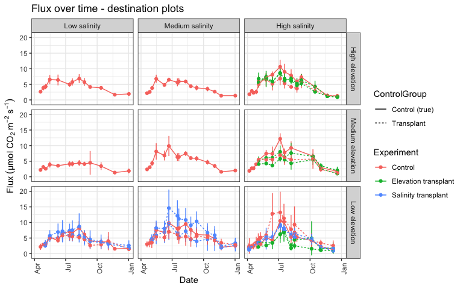
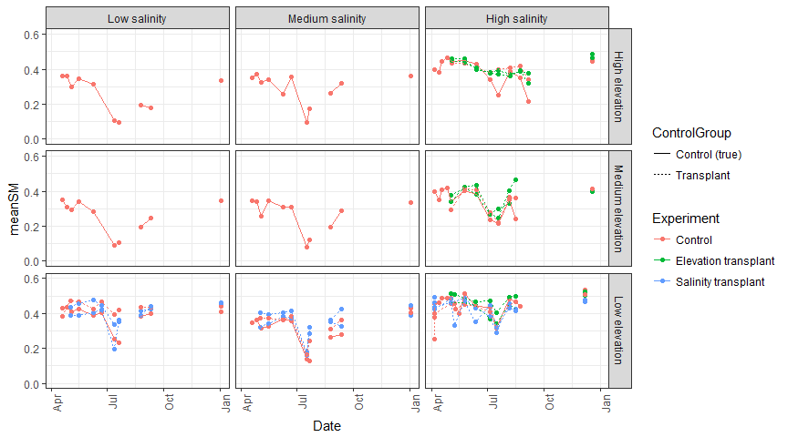
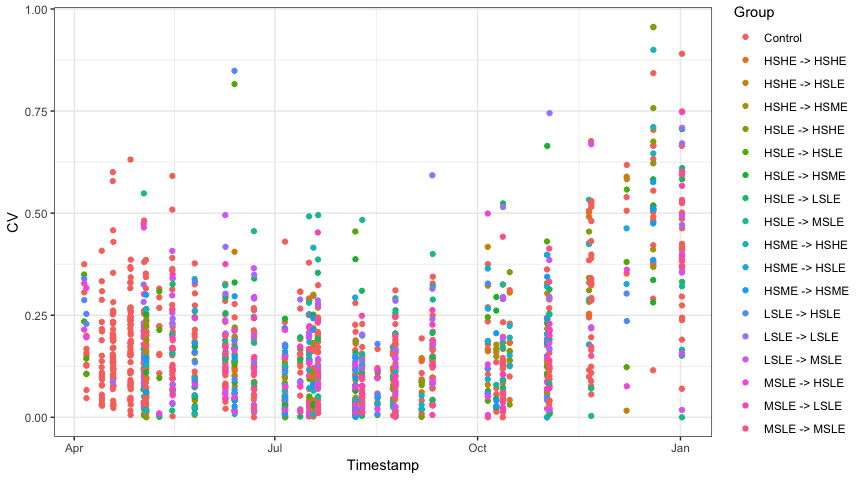
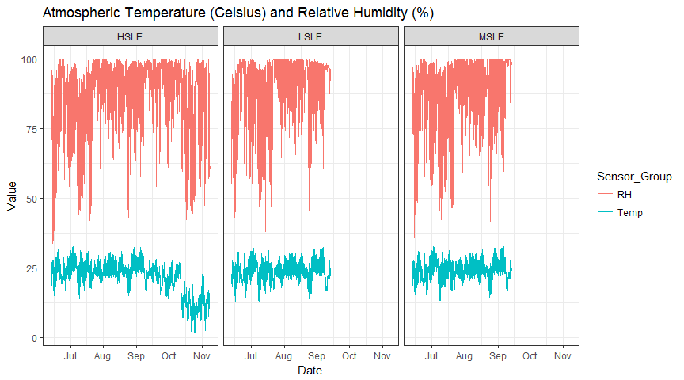
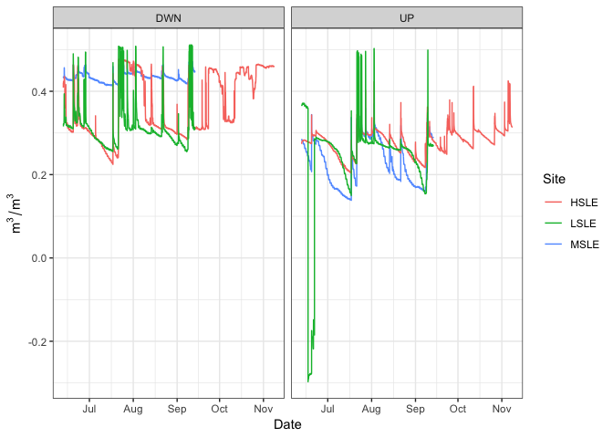
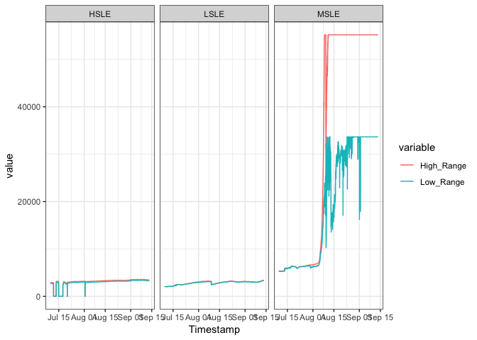
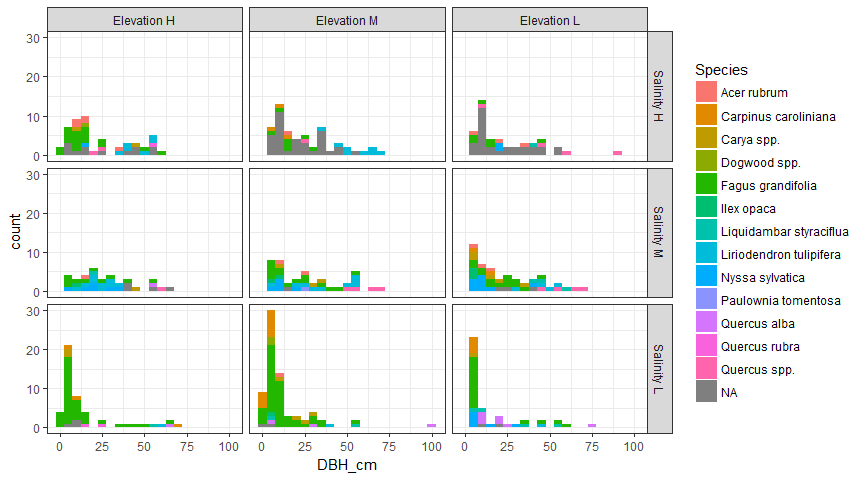

<!-- README.md is generated from README.Rmd. Please edit that file -->
PREMIS-ghg
==========

### Soil GHG experiment

#### Motivation

Disturbances such as sea level rise, increased extreme weather events, and climate change can have lasting impacts on terrestrial ecosystems. Monitoring greenhouse gas fluxes at the terrestrial-aquatic interface offers a way to quantify the stability and resilience of terrestrial soils in a stressed environment.

#### Design

We are testing soil response to salt water intrusion by monitoring soil respiration rates along a creek transect at the [Smithsonian Environmental Research Center (SERC)](https://serc.si.edu/). We have transplanted soil cores (40 cm diameter, 20 cm depth) along a salinity and elevation gradient at three locations (~1 km between salinity plots, ~50 m between elevation plots). This design will also be replicated on the west coast at Beaver Creek. We hypothesize that an increase in salinity will *suppress* soil CO2 respiration, but not affect methane production.

More info [here!](https://osf.io/at9hr)

  

Real-time data diagnostics
==========================

**Last run: Wed Jan 9 14:14:48 2019**

<table>
<thead>
<tr>
<th style="text-align:left;">
Site
</th>
<th style="text-align:left;">
Experiment
</th>
<th style="text-align:right;">
N
</th>
</tr>
</thead>
<tbody>
<tr>
<td style="text-align:left;">
SERC
</td>
<td style="text-align:left;">
Control
</td>
<td style="text-align:right;">
56
</td>
</tr>
<tr>
<td style="text-align:left;">
SERC
</td>
<td style="text-align:left;">
Elevation transplant
</td>
<td style="text-align:right;">
32
</td>
</tr>
<tr>
<td style="text-align:left;">
SERC
</td>
<td style="text-align:left;">
Salinity transplant
</td>
<td style="text-align:right;">
36
</td>
</tr>
</tbody>
</table>
IRGA data
---------

### CO2 flux over time

### Soil temperature versus CO2 flux for all cores

### Licor soil moisture over time

    #> Warning: Removed 72 rows containing missing values (geom_point).

### Coefficient of variation between collars

Weather station data
--------------------

### Soil temperature at 20 cm and 2 cm depth

### Air temperature and Relative Humidity

### Soil moisure at 20CM and 2CM depth

### Stdev for each temperature and moisture probe

    #> # A tibble: 192,810 x 7
    #> # Groups:   Site, Sensor_Depth, Sensor_Group [?]
    #>   Site  Sensor_Depth Sensor_Group Timestamp               n meanValue
    #>   <chr> <chr>        <chr>        <dttm>              <int>     <dbl>
    #> 1 HSLE  20CM         Temp         2018-06-12 13:53:03     3      17.6
    #> 2 HSLE  20CM         Temp         2018-06-12 14:08:03     3      17.6
    #> 3 HSLE  20CM         Temp         2018-06-12 14:23:03     3      17.6
    #> 4 HSLE  20CM         Temp         2018-06-12 14:38:03     3      17.6
    #> 5 HSLE  20CM         Temp         2018-06-12 14:53:03     3      17.6
    #> # … with 1.928e+05 more rows, and 1 more variable: sdValue <dbl>

Wells
-----

### Well conductivity data

    #> Warning: Removed 4 rows containing missing values (geom_path).

Other
-----

### Histogram of trees by DBH

    #> Warning: Removed 3 rows containing non-finite values (stat_bin).

### Coming soon: litter data!
